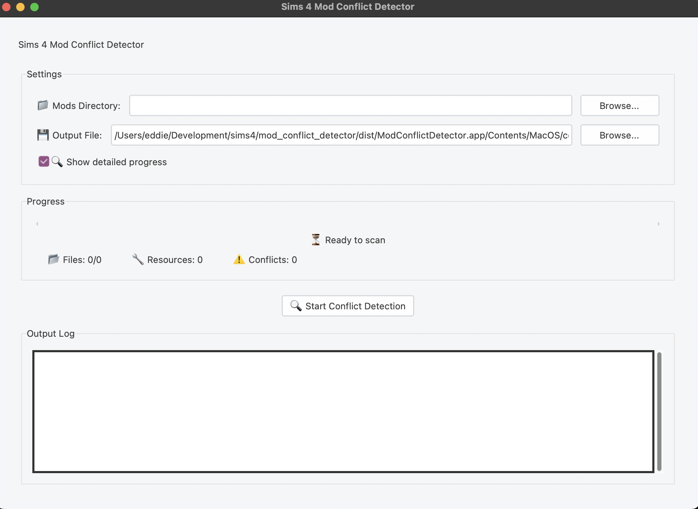

# Sims 4 Mod Conflict Detector

[](https://github.com/northcutted/Sims-4-Mod-Conflict-Detector/actions)

A modern, user-friendly tool to detect conflicts between Sims 4 mods by analyzing package files and identifying when multiple mods try to modify the same game resources.

<div align="center">
  
</div>

## Features

- Modern graphical interface with progress tracking
- Scans Sims 4 package files (.package) to extract resource identifiers
- Detects conflicts where multiple mods modify the same resources
- Provides detailed conflict analysis with severity levels
- Generates comprehensive CSV reports
- Visual indicators for conflict severity (🔴 High, 🟡 Medium, 🟢 Low)
- Resource type classification for better understanding of conflicts
- Cross-platform support (Windows, macOS, Linux)
- Supports both DBPF v1 and v2 package formats

## Screenshots



## Installation

### Windows
1. Download the latest release from the Releases page
2. Extract the ZIP file
3. Run `Sims 4 Mod Conflict Detector.exe`

### macOS
1. Download the latest release from the Releases page
2. Open the DMG file
3. Drag `Sims 4 Mod Conflict Detector.app` to your Applications folder
4. Open the app from Applications

### Linux
1. Download the latest release from the Releases page
2. Extract the archive
3. Run the executable

## Usage

1. Launch the application
2. Click "Browse" to select your Sims 4 Mods folder
3. (Optional) Choose a location for the conflict report CSV file
4. Click "Start Conflict Detection"
5. Review the results in the application and/or the generated report

### Common Paths to Sims 4 Mods Folder

- Windows: `C:\Users\[YourUsername]\Documents\Electronic Arts\The Sims 4\Mods`
- macOS: `~/Documents/Electronic Arts/The Sims 4/Mods`
- Linux: `~/Documents/Electronic Arts/The Sims 4/Mods`

## Understanding the Results

The tool categorizes conflicts by severity:

- 🔴 High: >100 shared resources - Mods likely incompatible, remove one
- 🟡 Medium: 10-100 shared resources - Mods may have issues, test in game
- 🟢 Low: <10 shared resources - Minor conflicts, probably safe

The CSV report provides detailed information about:
- Which mods conflict with each other
- Number of shared resources
- Types of resources in conflict
- Recommended actions

## Troubleshooting

### Common Issues

1. **Gray/empty windows**: Try reinstalling the application
2. **Can't find mods folder**: Enter the path manually or ensure you have access to the Documents folder
3. **No conflicts detected**: Verify you selected the correct Mods folder and that it contains .package files

### Error Messages

- "Invalid package file": The file may be corrupted or not a valid Sims 4 package
- "Access denied": Check folder permissions
- "No mods found": Verify the selected folder contains .package files

## Development

### Requirements

- Python 3.8 or newer
- Required packages:
  - tkinter (usually comes with Python)
  - pillow (for icon handling)

### Building from Source

1. Clone the repository
2. Install dependencies: `pip install -r requirements.txt`
3. Run: `python mod_conflict_detector.py`

To build the executable:
```bash
pyinstaller ModConflictDetector.spec
```

## License

This project is licensed under the MIT License - see the LICENSE file for details.

## Acknowledgments

- The Sims 4 modding community for documentation of the DBPF file format
- All contributors to the project
